# Getting Started with GitHub

## Introduction

Been a couple of months since I got around to writing a new post for this blog...busy times. Just got back from a company team building event in Tunisia last weekend. During this event we held 6 sessions about various topics such as Web API ([@JefClaes](https://twitter.com/JefClaes)), Roslyn ([@svenschelfaut](https://twitter.com/svenschelfaut)), Solid...etc.

I gave a session about using various alternative technologies (read as: non Microsoft) to build a web application from scratch. These included:

- [GitHub](https://github.com/)
- [Twitter Bootstrap](http://twitter.github.com/bootstrap/)
- [MongoDB](http://www.mongodb.org/)
- [Knockout.js](http://knockoutjs.com/)
- [AppHarbor](https://appharbor.com/)

So we've got everything from source control (GitHub), to layout (Bootstrap), database (MongoDB), client-side data binding / UI refreshes / ... (Knockout) and deployment (AppHarbor).

Let's discuss the first part in this article, namely GitHub. If you are already familiar with it, then you won't learn anything new here. However if you are a Windows developer and have never used Git, this might be an easy way to get familiar with it.

## Signup at GitHub

Of course you need to [signup at GitHub](https://github.com/plans). For open source it's free. With a free account, you can create unlimited public repositories. Paying (and thus private repositories) range from 7$/mo to 200$/mo.

Once you've signed up and your account is in order, go ahead and download the [GitHub for Windows client](http://windows.github.com/). It's the easiest way to use Git on Windows.

The installation is straightforward. Wizard-style, click next, next, next...etc. After you've started the application log in using your GitHub credentials. If you are familiar with Zune you'll recognize the UI design.

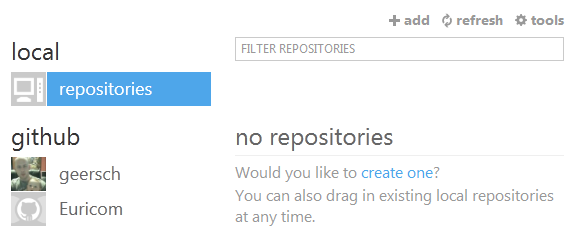

On the lefthand side you see two categories, **local** and **github**. The local category lists the repositories that you've copied (or cloned in git terms) to your PC. The github category lists the repositories that you've stored remotely on GitHub. As it stands now we don't have any local or remote repositories.

## Your First Repository

Let's create our first repository. I usually do this via the GitHub site. Just go to the main page, you'll find a "New repository" button somewhere on the righthand side.

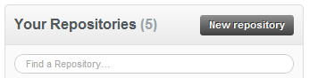

Name the new repository "HelloWorld" and click "New repository". You'll be redirected to a new page where you'll have to specify a few details about the new repository.

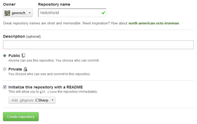

You need to enter the following data:

- Repository name (HelloWorld)
- Description (optional)
- Public or Private (only available if you have a paid account)
- Initialize the repository with a README file
- Specify a .gitignore file

Most of these settings are-self explanatory. Make sure you specify a .gitignore file for the programming language in which your application will be written. Obviously I opted for C# here.

Using the `.gitignore` file you can specify the file types you do not wish to include in the repository (binaries, ReSharper files, archives...etc.).

Once all the details have been filled out go ahead and click on the "Create repository" button. Once the repository has been created you'll see that it contains two files, namely a README.md and the .gitignore file. Using the Web UI you can directly edit the .gitignore file and copy/paste the contents of my C# .gitignore file. Go ahead and do so if you want.

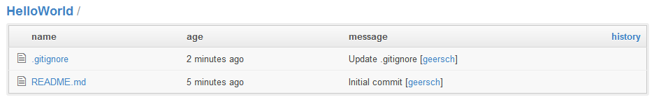

## Cloning

Alright, you've now created your first remote repository. Time to clone it to your local hard drive. First you need to specify a default storage directory. Go back to the GitHub Windows client and select "Tools > Options". Specify your default storage directory and click Update to save the settings.

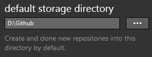

Back in the main screen select your account under the "github" category. You'll get a list of your remote repositories. Select the HelloWorld repository, right click it and select the Clone option. The remote repository will now be cloned to your local hard drive.

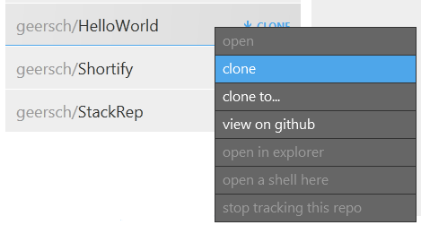

The remote repository is now cloned to your local storage directory. You should see a HelloWorld directory, that contains two files (README.md & .gitignore) and also a hidden .git folder.

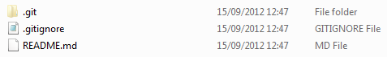

## Working with the Shell

Up until now we've been using the GitHub site and the Windows client to interact with GitHub. The rest of the work will be done using the git shell or for Windows users the PowerShell that is installed with the Windows client. You can always change the default shell in the options section.

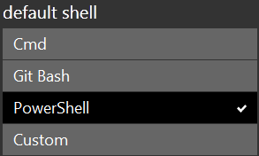

I'm used to working with the PowerShell, so let's stick with that one for now. Basically I only use the Windows client to clone my remote repositories. The rest of the git interaction is done via the shell. You can quickly open a shell for a repository by selecting the local repository in the Windows client, right-clicking on it and selecting the option "Open a shell here".

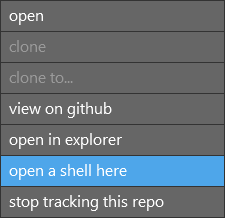

Voila, you've now opened a shell for the HelloWorld repository. As you can see in the screenshot below you're currently located on the master branch of the repository.

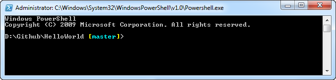

## Shell Commands

Let's learn the basic commands you can issue in the shell.

### git status

Use "git status" to query the state or your project. Right now we have a clean working directory as we've changed nothing.

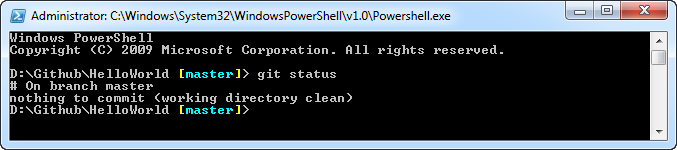

Let's add a file called "helloworld.txt" to the working directory.

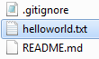

If you run the "git status" command again, you'll get the following result.

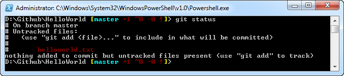

Git noticed you've added one new untracked file (helloworld.txt).

### git add

To have git track the new file you need to use the "git add" command.

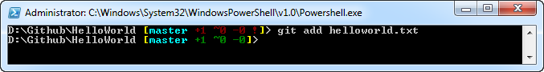

If you change a file that's already being tracked you also need to "re-add" it using the "git add" command. You can add each new (or changed) file manually or you can use the shorthand command "git add .". This will add all the new / changed files in one go.

### git commit

Let's make our first commit. When committing something in git you are always required to enter a comment to describe your commit. Luckily it's not optional. It's still up to you to enter a good commit message. "Fixed bug" or "So my boss wanted this button..." are not good example of commit messages.

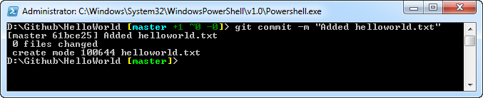

### git push

If you perform the "git status" command, you'll see that you have a clean working directory once again. But if you check the commit history on your remote repository using the GitHub site you won't find the commit anywhere. That's because all the commits happen locally. You need to issue the "git push" command to effectively push your local commits to your remote repository.

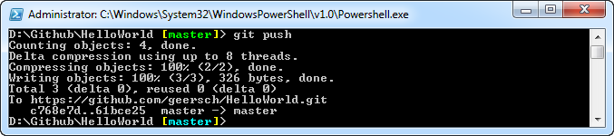

If you check the commit history now, you'll see that your local commits have been pushed to the remote repository.

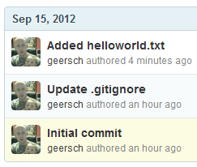

### git pull

What if someone else pushed commits to the remote repository and you are working on a outdated local version? Easy, just open the shell and issue the "git pull" command. This will fetch from a remote repository and try to merge the changes into the current branch.

You can try this by first editing the helloworld.txt file using the GitHub site. If you then issue the "git pull" command git will merge the changes into your local repository.

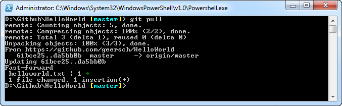

I hope you enjoyed this quick introduction to GitHub / Git. If you want to learn more about the git command-line interface, check out the [Git Reference](http://gitref.org/).
